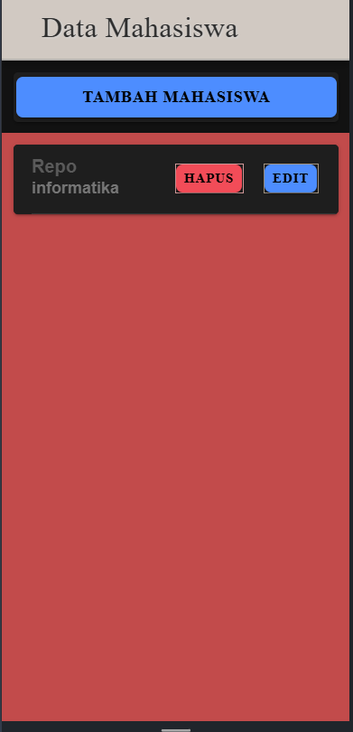
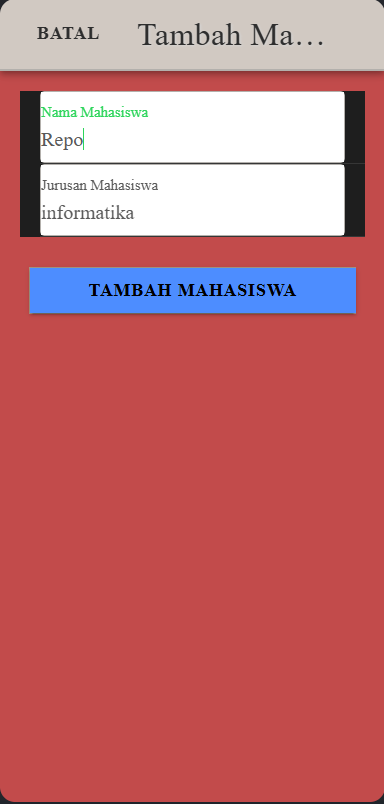
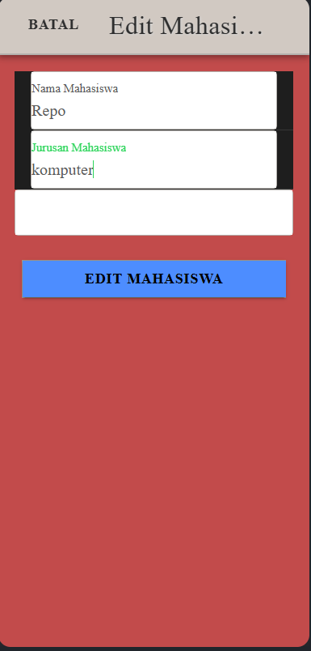
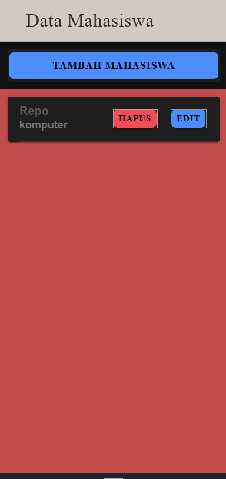
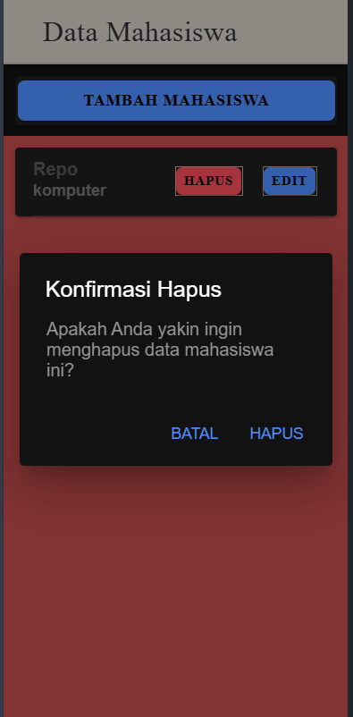
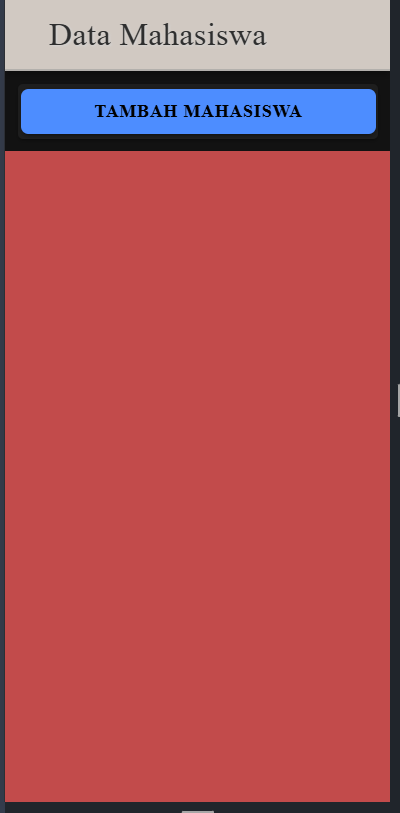

## Repo Wianata Barus
## H1D022029
## Shift F
## Shift KRS C
---


## Struktur Kode Utama

- `mahasiswa.page.ts`: Menangani logika CRUD dan pengelolaan modal.
- `mahasiswa.page.html`: Mengatur tampilan dan elemen UI di halaman.
- `api.service.ts`: Berfungsi sebagai service untuk menghubungkan aplikasi dengan server backend melalui API.

## Alur CRUD

### 1. **Menampilkan Data Mahasiswa (Read)**


Ketika halaman dimuat, aplikasi akan mengambil daftar data mahasiswa dari server.

#### Langkah-Langkah:
1. **Komponen `ngOnInit()`**:
   Fungsi ini otomatis dijalankan ketika halaman diinisialisasi untuk mengambil data dari server.
   ```typescript
   ngOnInit() {
     this.getMahasiswa();
   }
   ```

2. **Fungsi `getMahasiswa()`**:
   - Memanggil API `tampil.php` untuk mendapatkan data dari server.
   - Data kemudian disimpan dalam variabel `dataMahasiswa` untuk ditampilkan di halaman.
   ```typescript
   getMahasiswa() {
     this.api.tampil('tampil.php').subscribe({
       next: (res: any) => {
         console.log('Data mahasiswa berhasil diambil', res);
         this.dataMahasiswa = res;
       },
       error: (err: any) => {
         console.log('Gagal mengambil data mahasiswa', err);
       },
     });
   }
   ```
   
3. **Menampilkan Data di HTML**:
   Data mahasiswa yang disimpan dalam `dataMahasiswa` akan ditampilkan menggunakan loop `*ngFor`.
   ```html
   <ion-card *ngFor="let item of dataMahasiswa">
     <ion-item>
       <ion-label>
         {{ item.nama }}
         <p>{{ item.jurusan }}</p>
       </ion-label>
       <ion-button color="primary" slot="end" (click)="openModalEdit(true, item.id)">Edit</ion-button>
       <ion-button color="danger" slot="end" (click)="confirmHapus(item.id)">Hapus</ion-button>
     </ion-item>
   </ion-card>
   ```

### 2. **Menambahkan Data Mahasiswa (Create)**


Proses penambahan data dilakukan melalui modal input. Data yang dimasukkan akan dikirim ke server menggunakan metode POST.

#### Langkah-Langkah:
1. **Modal Input Data**:
   Pengguna membuka modal dengan menekan tombol "Tambah Mahasiswa".
   ```html
   <ion-button (click)="openModalTambah(true)" expand="block">Tambah Mahasiswa</ion-button>
   ```

2. **Fungsi `tambahMahasiswa()`**:
   - Memeriksa apakah input `nama` dan `jurusan` sudah terisi.
   - Mengirim data ke `tambah.php` melalui `this.api.tambah()`.
   - Setelah berhasil menambahkan data, modal ditutup dan daftar diperbarui dengan memanggil `getMahasiswa()`.
   ```typescript
   tambahMahasiswa() {
     if (this.nama && this.jurusan) {
       let data = { nama: this.nama, jurusan: this.jurusan };
       this.api.tambah(data, 'tambah.php').subscribe({
         next: () => {
           this.resetModal();
           this.getMahasiswa();
           console.log('Mahasiswa berhasil ditambahkan');
           this.modalTambah = false;
           this.modal.dismiss();
         },
         error: (err) => {
           console.log('Gagal menambahkan mahasiswa', err);
         }
       });
     } else {
       console.log('Input tidak lengkap');
     }
   }
   ```

3. **Service API `tambah()`**:
   Di `api.service.ts`, `tambah()` melakukan POST request ke server dengan data mahasiswa yang baru.
   ```typescript
   tambah(data: any, endpoint: string) {
     return this.http.post(`${this.url}/${endpoint}`, data);
   }
   ```

### 3. **Mengedit Data Mahasiswa (Update)**



Pengguna dapat memilih data mahasiswa untuk diedit, lalu melakukan perubahan yang diperlukan.

#### Langkah-Langkah:
1. **Membuka Modal Edit**:
   Data yang akan diedit diambil terlebih dahulu menggunakan `ambilMahasiswa()`, kemudian diisi di dalam modal edit.
   ```typescript
   openModalEdit(isOpen: boolean, idget: any) {
     this.modalEdit = isOpen;
     this.id = idget;
     this.ambilMahasiswa(this.id);
     this.modalTambah = false;
     this.modalEdit = true;
   }
   ```

2. **Fungsi `editMahasiswa()`**:
   - Mengirim data mahasiswa yang sudah diubah ke `edit.php` melalui `this.api.edit()`.
   - Jika berhasil, daftar mahasiswa akan diperbarui dengan `getMahasiswa()`.
   ```typescript
   editMahasiswa() {
     let data = { id: this.id, nama: this.nama, jurusan: this.jurusan };
     this.api.edit(data, 'edit.php').subscribe({
       next: () => {
         this.resetModal();
         this.getMahasiswa();
         console.log('Data mahasiswa berhasil diedit');
         this.modalEdit = false;
         this.modal.dismiss();
       },
       error: (err) => {
         console.log('Gagal edit mahasiswa', err);
       }
     });
   }
   ```

3. **Service API `edit()`**:
   Di `api.service.ts`, `edit()` mengirim data yang telah diubah ke server.
   ```typescript
   edit(data: any, endpoint: string) {
     return this.http.put(`${this.url}/${endpoint}`, data);
   }
   ```

### 4. **Menghapus Data Mahasiswa (Delete)**


Pengguna dapat menghapus data mahasiswa dengan menekan tombol "Hapus".

#### Langkah-Langkah:
1. **Membuka Alert Konfirmasi**:
   Ketika tombol hapus ditekan, alert konfirmasi muncul melalui `confirmHapus()`.
   ```typescript
   async confirmHapus(id: any) {
     const alert = await this.alertController.create({
       header: 'Konfirmasi',
       message: 'Apakah Anda yakin ingin menghapus data ini?',
       buttons: [
         { text: 'Batal', role: 'cancel' },
         { text: 'Hapus', handler: () => this.hapusMahasiswa(id) }
       ]
     });
     await alert.present();
   }
   ```

2. **Fungsi `hapusMahasiswa()`**:
   - Menghapus data mahasiswa berdasarkan `id` melalui `hapus.php`.
   - Setelah berhasil, daftar mahasiswa akan diperbarui dengan `getMahasiswa()`.
   ```typescript
   hapusMahasiswa(id: any) {
     this.api.hapus(id, 'hapus.php').subscribe({
       next: () => {
         this.getMahasiswa();
         console.log('Data mahasiswa berhasil dihapus');
       },
       error: (err) => {
         console.log('Gagal menghapus mahasiswa', err);
       }
     });
   }
   ```

3. **Service API `hapus()`**:
   Di `api.service.ts`, `hapus()` melakukan DELETE request ke server.
   ```typescript
   hapus(id: any, endpoint: string) {
     return this.http.delete(`${this.url}/${endpoint}?id=${id}`);
   }
   ```

---